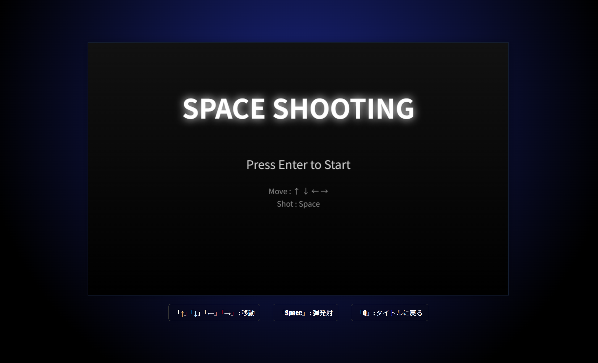
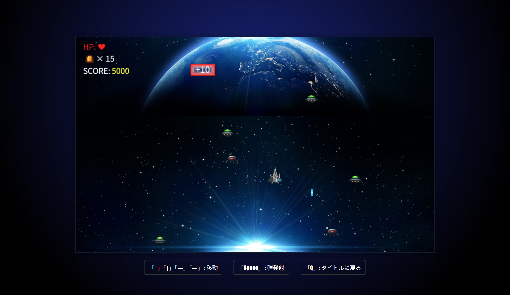
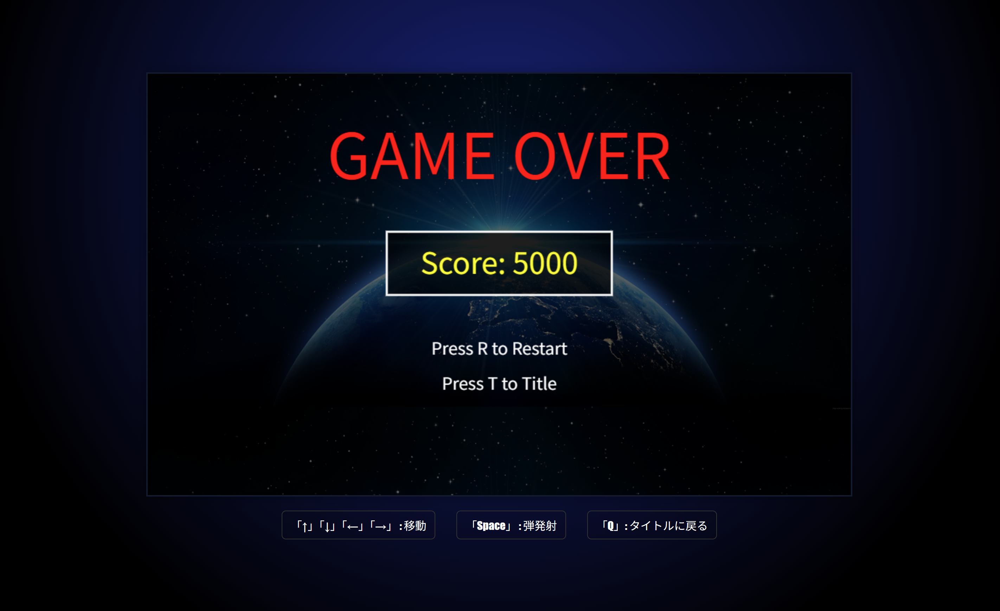

# shooting

## 概要
HTML / JavaScript / CSS を用いて作成したブラウザ向けシューティングゲームです。  
プレイヤーは戦闘機を操作し、敵を倒しながらスコアを伸ばします。
途中で登場するアイテムを取るとゲームを優位に進められます。

---

## 工夫した点

### 弾数制限の導入
弾を無制限にせず、弾薬を管理することで、プレイヤーに判断を求める設計にした。

### update と draw の分離
処理と描画を分けることで、コードの見通しを良くし、機能追加しやすい構造にした。

### シーン管理
タイトル・ゲーム・ゲームオーバーの状態を分離し、処理を整理した。

### ステージ構成
時間に応じて敵を出現させる仕組みにより、ステージの流れを調整できるようにした。

---

## 使用言語
HTML / CSS / JavaScript

---

</> Markdown
## ディレクトリ構成
```
shooting/
├── js/
│ ├── assets/ # 画像・音声素材
│ ├── core/ # 状態管理
│ ├── entities/ # プレイヤー・敵・弾
│ ├── render/ # 描画処理
│ ├── scene/ # シーン管理
│ ├── system/ # 衝突・更新・スポーン
│ └── stage/ # ステージ定義
├── css/
├── sounds/
└── index.html
```

---

## 起動方法

### 1. クローン
```bash
git clone https://github.com/Mt-nasubi/shooting.git
cd shooting
```
### 2. index.htmlを開く
VSCode の Live Server を使用する

---

## プレイの様子

### タイトル画面


### ゲーム画面


### ゲームオーバー画面


---

## 操作方法

| キー | 動作 |
|------|------|
| ↑ ↓ ← → | 移動 |
| Space | 弾発射 |
| Q | タイトルに戻る |
| R | リスタート（ゲームオーバー時） |

---

## 主な機能

- プレイヤーの移動・攻撃
- 弾数制限とリソース管理
- 敵（2種類）の出現
- 回復・弾補充アイテム
- 衝突判定（敵・弾・アイテム）
- スコア管理
- BGM・効果音
- タイトル / ゲーム / ゲームオーバーの画面遷移

